# NEMS Dashboard System Architecture

```mermaid
graph TB
    subgraph "Frontend Layer"
        Next["Next.js App Router"]
        RC["React Components"]
        RQ["React Query"]
        Auth["Auth Components"]
        MW["Middleware"]
        CA["Cost Analysis"]
        DA["Demand Analysis"]
        SA["Sustainability Analysis"]
        style Next fill:#e1f5fe
        style RC fill:#e1f5fe
        style RQ fill:#e1f5fe
        style Auth fill:#e1f5fe
        style MW fill:#e1f5fe
        style CA fill:#e1f5fe
        style DA fill:#e1f5fe
        style SA fill:#e1f5fe
    end

    subgraph "Data Layer"
        SB["Supabase"]
        DB[("Database")]
        RT["Enhanced Realtime"]
        AuthDB["Auth Service"]
        CB["Cost Breakdowns"]
        ML["ML Models"]
        Cache["Smart Cache"]
        style SB fill:#e8f5e9
        style DB fill:#e8f5e9
        style RT fill:#e8f5e9
        style AuthDB fill:#e8f5e9
        style CB fill:#e8f5e9
        style ML fill:#e8f5e9
        style Cache fill:#e8f5e9
    end

    subgraph "Integration Layer"
        Claude["Anthropic Claude AI"]
        Sentry["Sentry Error Tracking"]
        WS["WebSocket Fallback"]
        style Claude fill:#fce4ec
        style Sentry fill:#fce4ec
        style WS fill:#fce4ec
    end

    subgraph "UI Components"
        Tremor["Tremor Components"]
        Charts["Recharts"]
        UI["Shared UI Components"]
        CostViz["Cost Visualization"]
        DemandViz["Demand Visualization"]
        SustainViz["Sustainability Viz"]
        style Tremor fill:#fff3e0
        style Charts fill:#fff3e0
        style UI fill:#fff3e0
        style CostViz fill:#fff3e0
        style DemandViz fill:#fff3e0
        style SustainViz fill:#fff3e0
    end

    subgraph "ML Layer"
        BillAnalyzer["Bill Analysis ML"]
        DemandPredictor["Demand Prediction"]
        PatternDetector["Pattern Detection"]
        AnomalyDetector["Anomaly Detection"]
        style BillAnalyzer fill:#f3e5f5
        style DemandPredictor fill:#f3e5f5
        style PatternDetector fill:#f3e5f5
        style AnomalyDetector fill:#f3e5f5
    end

    Auth --> SB
    SB --> AuthDB
    MW --> Auth
    Next --> RC
    Next --> MW
    RC --> RQ
    RC --> UI
    RQ --> SB
    SB --> DB
    RT --> RQ
    RT --> WS
    Claude --> BillAnalyzer
    Next --> Sentry
    RC --> Tremor
    RC --> Charts
    CA --> CostViz
    DA --> DemandViz
    SA --> SustainViz
    CA --> CB
    CB --> DB
    ML --> BillAnalyzer
    ML --> DemandPredictor
    ML --> PatternDetector
    ML --> AnomalyDetector
    Cache --> RT
    Cache --> ML
```



## Key Components

1. **Frontend Layer**
   - Next.js 15.1.4 with App Router
   - React 18.2.0 components
   - TanStack React Query for data management
   - TypeScript for type safety
   - Authentication components
   - Protected route middleware
   - Cost analysis components
   - Demand profiling
   - Sustainability metrics
   - Real-time updates

2. **Data Layer**
   - Supabase for database and auth
   - Enhanced real-time with WebSocket fallback
   - Smart caching system
   - ML model storage
   - Structured data models for:
     - Energy data
     - Cost breakdowns
     - Time-of-use patterns
     - Usage correlations
     - Demand profiles
     - Sustainability metrics
   - Authentication state
   - Row-level security

3. **Integration Layer**
   - Anthropic Claude AI integration
   - Sentry error tracking
   - WebSocket fallback system
   - ML model integration
   - Real-time data sync
   - API integrations
   - Authentication flow
   - Data validation

4. **UI Components**
   - Tremor for dashboards
   - Recharts for visualization
   - Cost visualizations:
     - Breakdown charts
     - Time-of-use heatmaps
     - Trend analysis
   - Demand visualizations:
     - Real-time tracking
     - Peak predictions
     - Response suggestions
   - Sustainability visualizations:
     - Carbon metrics
     - Renewable tracking
     - Efficiency scores
   - TailwindCSS styling
   - Shared component library

5. **ML Layer**
   - Bill analysis system
   - Demand prediction
   - Pattern detection
   - Anomaly detection
   - Cost prediction
   - What-if analysis
   - Sustainability scoring
   - Real-time insights

## Data Flow

1. **Authentication Flow**
   ```mermaid
   sequenceDiagram
       User->>Middleware: Access protected route
       Middleware->>Auth: Check auth state
       Auth->>Supabase: Verify session
       Supabase-->>Auth: Session status
       Auth-->>Middleware: Auth result
       Middleware-->>User: Route access/redirect
   ```

2. **Main Application Flow**
   ```mermaid
   sequenceDiagram
       User->>React: Interaction
       React->>Query: Data request
       Query->>Cache: Check cache
       Cache-->>Query: Cache hit/miss
       Query->>Supabase: DB query if cache miss
       Supabase-->>Query: Data
       Query->>ML: Process data
       ML-->>Query: Insights
       Query->>React: Update UI
   ```

3. **Cost Analysis Flow**
   ```mermaid
   sequenceDiagram
       Component->>Hook: Request cost data
       Hook->>Cache: Check cache
       Cache-->>Hook: Cache status
       Hook->>Supabase: Fetch if needed
       Hook->>ML: Process data
       ML-->>Hook: Analysis results
       Hook->>Component: Update view
   ```

4. **Real-time Updates**
   ```mermaid
   sequenceDiagram
       Source->>WebSocket: Data update
       WebSocket->>Cache: Update cache
       Cache->>React Query: Invalidate
       React Query->>Components: Refresh
       Components->>UI: Update view
   ```

## Security Layer

1. **Authentication**
   - Supabase auth service
   - Protected routes
   - Session management
   - Form validation
   - Smart caching
   - Rate limiting
   - CSRF protection

2. **Data Protection**
   - Row-level security
   - Type-safe queries
   - Secure API routes
   - Environment variables
   - ML model security
   - Real-time validation
   - Data encryption

## Database Schema

1. **Core Tables**
   ```sql
   -- Clients
   CREATE TABLE clients (
     id UUID PRIMARY KEY,
     name TEXT NOT NULL,
     settings JSONB
   );

   -- Locations
   CREATE TABLE locations (
     id UUID PRIMARY KEY,
     client_id UUID REFERENCES clients,
     name TEXT NOT NULL,
     metadata JSONB
   );

   -- Energy Data
   CREATE TABLE energy_data (
     id UUID PRIMARY KEY,
     location_id UUID REFERENCES locations,
     timestamp TIMESTAMPTZ NOT NULL,
     usage DECIMAL NOT NULL,
     demand DECIMAL,
     cost DECIMAL
   );

   -- Cost Breakdowns
   CREATE TABLE cost_breakdowns (
     id UUID PRIMARY KEY,
     energy_data_id UUID REFERENCES energy_data,
     breakdown JSONB NOT NULL
   );
   ```

2. **Relationships**
   - Client -> Locations (1:many)
   - Location -> Energy Data (1:many)
   - Energy Data -> Cost Breakdowns (1:1)
   - Location -> Demand Profiles (1:many)
   - Location -> Sustainability (1:many)

3. **Optimizations**
   - Timestamp indexing
   - Client partitioning
   - Query optimization
   - Data compression
   - Cache invalidation
   - Real-time sync

## Performance Optimizations

1. **Data Fetching**
   - Smart query caching
   - Incremental loading
   - Real-time sync
   - WebSocket fallback
   - Batch processing
   - Query optimization

2. **Rendering**
   - Component memoization
   - Virtual scrolling
   - Code splitting
   - Lazy loading
   - Cache awareness
   - Predictive loading

3. **ML Processing**
   - Model caching
   - Batch predictions
   - Incremental updates
   - Resource optimization
   - Version control
   - Distributed processing

4. **Real-time Updates**
   - Smart caching
   - WebSocket optimization
   - Batch updates
   - Priority queuing
   - Fallback handling
   - Connection recovery
