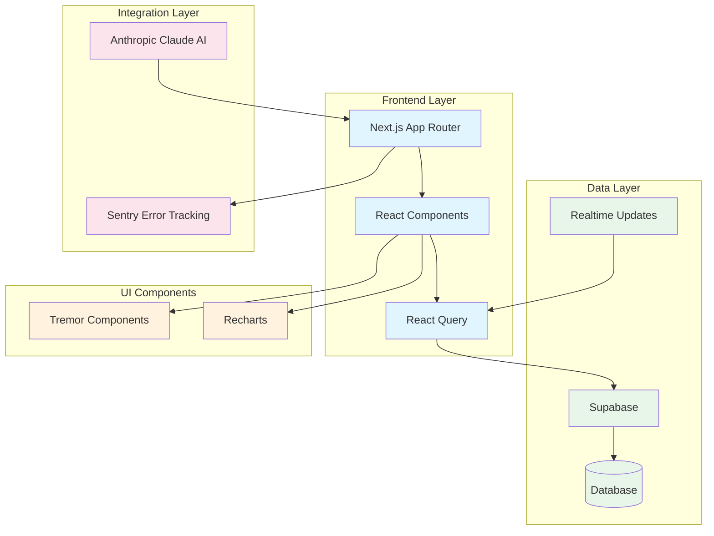

# NEMS Dashboard System Architecture

## Key Components

1. **Frontend Layer**
   - Next.js 15.1.4 with App Router
   - React 18.2.0
   - TanStack React Query for data fetching
   - TypeScript for type safety

2. **Data Layer**
   - Supabase for database and authentication
   - Real-time updates subscription
   - Structured data models for locations and energy data

3. **Integration Layer**
   - Anthropic Claude AI integration
   - Sentry for error tracking and monitoring

4. **UI Components**
   - Tremor for dashboard components
   - Recharts for data visualization
   - TailwindCSS for styling

## Data Flow

1. User interactions trigger React Query data fetches
2. Supabase handles data persistence and real-time updates
3. Claude AI processes bill analysis
4. Tremor/Recharts render visualizations
5. Sentry monitors for errors and performance issues
